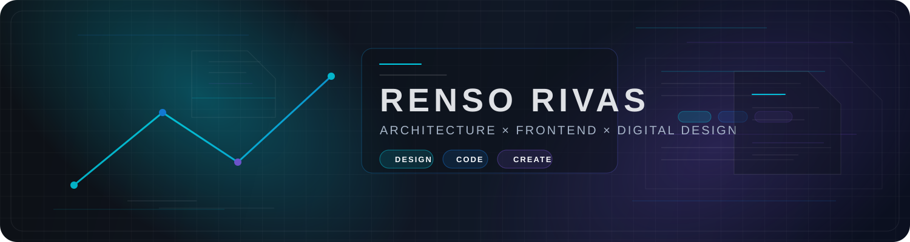
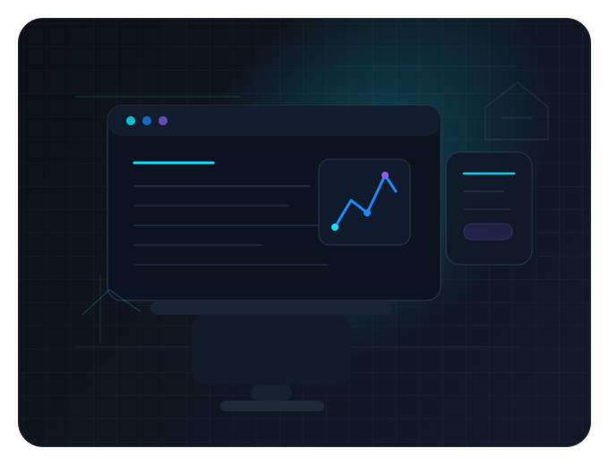
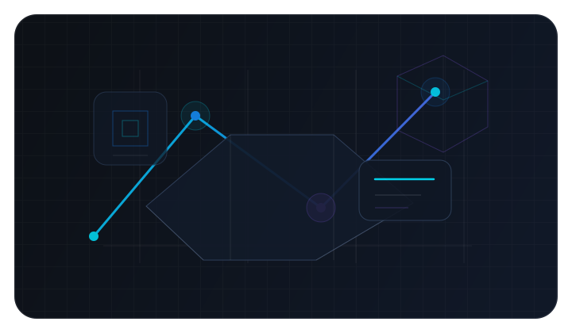



  

 

<h1 align="center">Hi 👋, I'm Renso Rivas</h1>

<strong>Architecture × Frontend Development × Digital Design</strong>

I create digital experiences where design, technology and visual thinking connect.

 

  
  
  
  
  

  

<table>
  <tr>
    <td width="54%" valign="top">
      <h2>About Me</h2>
      
Frontend Development

      
UI / UX &amp; Digital Design

      
Architecture &amp; Technology

      
Photography &amp; Visual Content

      
Exploring new technologies

      
Building personal projects

       
      <h3>Currently exploring</h3>
      
React

      
Responsive Web Design

      
Web Animation

      
Git &amp; GitHub

      
Digital Experiences

    </td>
    <td width="46%" align="center" valign="middle">
      
    </td>
  </tr>
</table>

  

## Languages & Tools

  

  

## Featured Projects

  
  

  
  

  

## GitHub Analytics

  
  

  

  

  

<table>
  <tr>
    <td width="44%" align="center" valign="middle">
      
    </td>
    <td width="56%" valign="middle">
      <h2>Architecture × Technology</h2>
      
Exploring how spatial thinking, digital interfaces and technology can create new forms of experience.

    </td>
  </tr>
</table>

  

## Connect With Me

  
  
  
  

 

  

<strong>DESIGN × CODE × CREATE</strong>

Building the next version.

